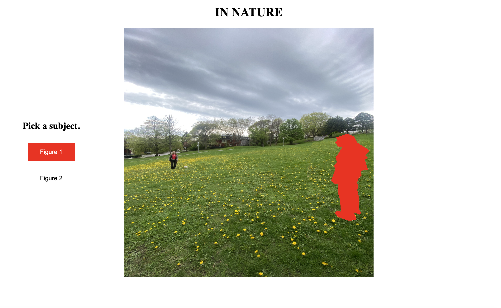
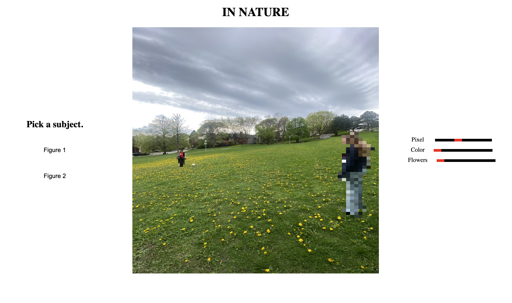
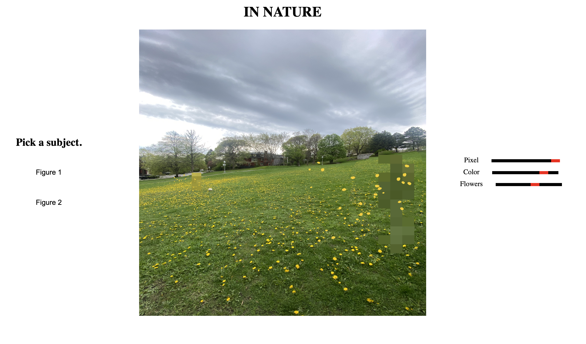

# In Nature
 
An interactive web piece starring two figures in a field, mess around with the settings to make them disappear into the environment. 
Once you're done, take a step back. Was this successful?

## Try it here!
**[Live demo](https://oceanedaumasson.github.io/InNature/)**

## Screenshots

## About
This work asks whether they can ever truly become part of the environment around them. Adjusting pixelation, color, and overgrowth in real time, they seem closer and closer to disappearing into nature. However, is this really integration? Or just distortion made to look like it?

## Features
- Real-time pixelation and color overlay
- Procedurally scattered flora with adjustable position, size, and density
## Built with
JavaScript, HTML, CSS
